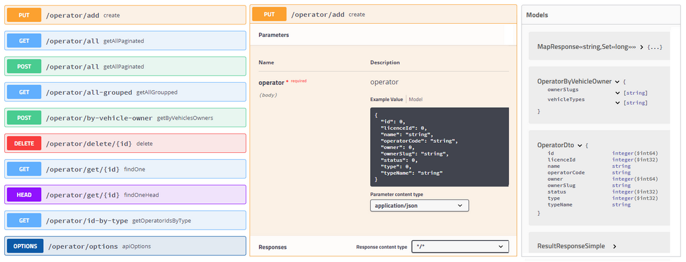

## Overview

This project is an example of REST API based on Spring Boot 2. Project present example of City Transport network (e.g. underground, overground, trains network). 
 
The module has 2 main controllers, `ApiController` - for handling API communication 
and `OperatorController` which can be used for managing Operators.

`OperatorController` allows all requests from any domain _(COSRS is settled to "allow all")_, 
`ApiController` allows only "server to server" communication.

Module has DDL schema autoupdate settled to false and also 
[Flyway migration](https://flywaydb.org/) which should create all DB schema automatically.

See `src/main/resources/db/migration/V1.0__init.sql`

##### Idea and assumptions

##### Api Communication flow

##### Models relations

## Run on Docker

1. Build app image    

        rest-transport-api> mvn clean package docker:build

2. Go to /docker directory

        rest-transport-api> cd ./src/main/docker

3. Docker compose

        rest-transport-api/src/main/docker> docker-compose up

4. Test via Swagger [http://localhost:8080/swagger-ui.html](http://localhost:8080/swagger-ui.html)
    
5. Useful docker commands

        : go to cantainer and run bach
        docker exec -it rest-transport-api /bin/bash
        
        : stop all containers
        docker stop $(docker ps -a -q)
        
        : delete all containers
        docker rm $(docker ps -a -q)
        
        : delete all images 
        docker rmi $(docker images -q)
        
        : restart docker machine
        docker-machine restart default
        
        : get the IP address of machines
        docker-machine ip
        
    See more about Docker [https://www.docker.com/](https://www.docker.com/)

---

## Docs & examples
    
### Swagger documentation & "try it out"

See API Documentation on Swagger [HOST/swagger-ui.html#/](http://localhost/swagger-ui.html#/)

*You can send any requests via any client such us `Postman` or `Insomnia` or just try it out 
via `SWAGGER` on project/host/swagger-ui.html*

Swagger is a popular API development tool which can help you to build and test APIs.

### UtilsController

> Load fake data via controller (only on profiles "dev" and "docker")

    # Request 
        GET /utils/load-fake-data
        
    # Response
        {
            "code": "OK",
            "errors": null,
            "warnings": null
        }

##### OperatorController    
> Get all Operators

    # Request
        GET|POST /operator/all?page=3&size=2
        GET|POST /operator/all
    
    # Response
        {
            "code": "OK",
            "errors": null,
            "warnings": null,
            "result": [
                {
                    "id": 92,
                    "name": "Operator #12",
                    "owner": 36,
                    "operatorCode": "operator-errorCode-12",
                    "licenceId": 5012,
                    "type": 1,
                    "status": 1,
                    "ownerSlug": "owner-slug-11",
                    "typeName": "private"
                },
                ...
            ]
        }

> Get all Operators groupped by Owner or Type

    # Request
    GET|POST /operator/all-grouped?groupBy=owner
    
    # Response
    {
        "code": "OK",
        "errors": null,
        "warnings": null,
        "result": {
            "owner-slug-3": [
                {
                    "id": 109,
                    "name": "Operator #5",
                    "owner": 34,
                    "operatorCode": "operator-errorCode-5",
                    "licenceId": 5005,
                    "type": 1,
                    "status": 3,
                    "ownerSlug": "owner-slug-3",
                    "typeName": "private"
                },
                {
                    "id": 111,
                    "name": "Operator #11",
                    "owner": 34,
                    "operatorCode": "operator-errorCode-11",
                    "licenceId": 5011,
                    "type": 2,
                    "status": 3,
                    "ownerSlug": "owner-slug-3",
                    "typeName": "mixed"
                }
            ]
            ...
        }
    }

> Get all Operators groupped by Type

    # Request
    GET|POST /operator/all-grouped?groupBy=typename

    # Response
    {
        "code": "OK",
        "errors": null,
        "warnings": null,
        "result": {
            "private": [
                {
                    "id": 109,
                    "name": "Operator #5",
                    "owner": 34,
                    "operatorCode": "operator-errorCode-5",
                    "licenceId": 5005,
                    "type": 1,
                    "status": 3,
                    "ownerSlug": "owner-slug-3",
                    "typeName": "private"
                },
                {
                    "id": 99,
                    "name": "Operator #8",
                    "owner": 26,
                    "operatorCode": "operator-errorCode-8",
                    "licenceId": 5008,
                    "type": 1,
                    "status": 1,
                    "ownerSlug": "owner-slug-17",
                    "typeName": "private"
                }
            ]
            ...
        }
    }

> Get all operators matching required types and owners, groupped by type and owner

    # Request
    POST /operator/by-vehicle-owner
    {"vehicleTypes":["train","underground","dlr","overground"],"ownerSlugs":["owner-slug-6","owner-slug-3"]}}
    
    # Response
    {
        "code": "OK",
        "errors": null,
        "warnings": null,
        "result": {
            "Underground": {
                "owner-slug-3": [
                    {
                        "id": 87,
                        "name": "Operator #11",
                        "owner": 40,
                        "operatorCode": "operator-errorCode-11",
                        "licenceId": 5011,
                        "type": 3,
                        "status": 3,
                        "ownerSlug": "owner-slug-3",
                        "typeName": "national"
                    }
                ]
            },
            "Overground": {
                "owner-slug-3": [
                    {
                        "id": 87,
                        "name": "Operator #11",
                        "owner": 40,
                        "operatorCode": "operator-errorCode-11",
                        "licenceId": 5011,
                        "type": 3,
                        "status": 3,
                        "ownerSlug": "owner-slug-3",
                        "typeName": "national"
                    }
                ]
                ...
            }
        }
    }

> Get list of operator IDs by type

    # Request
    GET /operator/id-by-type
    
    # Response
    {
        "code": "OK",
        "errors": null,
        "warnings": null,
        "result": {
            "private": [
                104,
                91
            ],
            "national": [
                112,
                97,
                95
            ],
            "mixed": [
                98
            ]
        }
    }

> Add/update operator

    # Request
    PUT /operator/add
    {"name":"Operator Ad 1","owner":6,"operatorCode":"operator-ad-1","licenceId":5019,"status":1,"ownerSlug":"owner-slug-15","type":1}
    
    # Response
    {
        "code": "OK",
        "errors": null,
        "warnings": null,
        "result": [
            {
                "id": 306,
                "name": "Operator Ad 1",
                "owner": 6,
                "operatorCode": "operator-ad-1",
                "licenceId": 5019,
                "type": 1,
                "status": 0,
                "ownerSlug": "owner-slug-16",
                "typeName": "private"
            }
        ]
    }

> Update / patch
    
    # Request
    PATCH /operator/update/306
    {"name":"Operator Ad 1ab","owner":6,"operatorCode":"operator-changed-1","licenceId":5019,"status":1,"ownerSlug":"owner-slug-15","type":1}
    
    # Response
    {
        "code": "OK",
        "errors": null,
        "warnings": null,
        "result": [
            {
                "id": 306,
                "name": "Operator Ad 1ab",
                "owner": 6,
                "operatorCode": "operator-changed-1",
                "licenceId": 5019,
                "type": 1,
                "status": 0,
                "ownerSlug": "owner-slug-16",
                "typeName": "private"
            }
        ]
    }

> Other services

    # Requests
    GET /operator/get/104
    HEAD /operator/get/104
    DELETE /operator/delete/104
    OPTIONS /operator/options

### ApiController 

POST /api/init

POST /api/touchin

POST /api/touchout

POST /api/refund
  
   
---

## Acknowledgments

### Frameworks & Libs 

+ Spring (https://spring.io/projects/spring-boot)

+ Hibernate (http://hibernate.org/)

+ Jackson (https://github.com/FasterXML/jackson-databind)

+ AspectJ (https://www.eclipse.org/aspectj/)

+ Flyway (https://flywaydb.org/)

+ Apache Commons (https://commons.apache.org/)

+ Swagger (https://swagger.io/)

+ Docker (https://www.docker.com/)

+ Lombok (https://projectlombok.org/)

### Used concepts

+ Naming Strategies (Snake & CammelCase) (https://docs.jboss.org/hibernate/orm/5.3/javadocs/org/hibernate/boot/model/naming/)

+ ThreadLocal (https://docs.oracle.com/javase/7/docs/api/java/lang/ThreadLocal.html)

+ Concurrency/Multithreading (https://docs.oracle.com/javase/tutorial/essential/concurrency/)

+ Spring Security (https://spring.io/projects/spring-security)

+ ResponseEntity (https://docs.spring.io/spring-framework/docs/current/javadoc-api/org/springframework/http/ResponseEntity.html)

+ Fork - Join & RecursiveTask (https://www.baeldung.com/java-fork-join) (https://docs.oracle.com/javase/8/docs/api/java/util/concurrent/RecursiveTask.html)

+ Custom annotations (https://docs.oracle.com/javase/tutorial/java/annotations/)

+ Events in Spring (https://docs.spring.io/spring/docs/2.5.x/reference/beans.html#context-functionality-events)

+ Sprind Data, JPA Repositories (https://docs.spring.io/spring-data/jpa/docs/current/reference/html/#reference)

+ Generics (https://docs.oracle.com/javase/tutorial/java/generics/index.html)

+ Java Streams & Optional (https://www.oracle.com/technical-resources/articles/java/ma14-java-se-8-streams.html) (https://docs.oracle.com/javase/9/docs/api/java/util/Optional.html)

+ Models Projector (https://github.com/glaures/modelprojector)

+ Spring Validators (https://docs.spring.io/spring/docs/3.0.0.RC3/reference/html/ch05s07.html)

+ Content Negotiation in Spring (https://spring.io/blog/2013/05/11/content-negotiation-using-spring-mvc)

---

## See also

**Author** - Slawomir Hadas (https://github.com/hadasbro)

